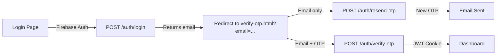

# OTP Flow Testing Guide - Simplified Architecture

## ✅ **What Changed**

### **Old Architecture (Complex):**
- Used Firebase idToken in sessionStorage
- Mixed authentication methods (Firebase + JWT)
- Complex state management
- Browser storage dependencies

### **New Architecture (Simple):**
- ✅ **No sessionStorage** - Email passed via URL
- ✅ **Email-only identification** - Simple and stateless
- ✅ **JWT cookies only** - Single auth method after OTP
- ✅ **Clean separation** - Login → OTP → JWT

## **Testing Steps**

### **1. Restart Your Server**
```bash
# Stop server (Ctrl+C)
# Start fresh:
node server/server.mjs
```

### **2. Clear Browser**
```javascript
// In browser console (F12):
localStorage.clear();
sessionStorage.clear();
// Hard refresh: Ctrl+Shift+R
```

### **3. Test Complete Flow**

#### **Step 1: Login**
1. Go to `http://localhost:5500/login/login.html`
2. Enter admin credentials
3. Click login
4. **Expected:** Redirects to `/login/verify-otp.html?email=youremail@gmail.com`

#### **Step 2: Check OTP Page**
1. Email should display at top
2. Check browser console for:
```
Verify OTP Page Loaded {...}
Verify OTP Page Data: {email: "youremail@gmail.com", ...}
```
3. Check URL has email parameter

#### **Step 3: Test Resend**
1. Click "Resend OTP"
2. **Browser Console should show:**
```
Resend OTP Request: {
  url: "http://localhost:3000/auth/resend-otp",
  body: {email: "youremail@gmail.com"}
}
Resend OTP Response: {status: 200, ok: true}
```
3. **Server Console should show:**
```
[resend-otp] OTP sent successfully to youremail@gmail.com
```
4. Check email for new OTP

#### **Step 4: Enter OTP**
1. Enter the 6-digit code
2. Click Verify
3. **Expected:** JWT cookie set, redirects to dashboard

## **How It Works Now**



## **Key Points**

### **No More sessionStorage:**
- Email passed via URL parameter
- Visible to user (transparent)
- Survives page refresh

### **Simple Server Endpoints:**
- `/auth/resend-otp` - Only needs email
- `/auth/verify-otp` - Only needs email + OTP
- Both endpoints look up user in Firebase by email

### **JWT Cookie Auth:**
- Set after OTP verification
- HTTP-only, secure cookie
- Used for all subsequent requests

## **Troubleshooting**

### **Issue: "No account found with this email"**
- Email doesn't exist in Firebase
- Check spelling/case

### **Issue: "OTP not required for this account type"**
- User role is not 'admin' or 'applicant'
- Check user role in Firestore

### **Issue: Rate Limiting**
- Wait 3 minutes between resends
- Max 5 resends per hour

### **Issue: OTP Expired**
- OTPs expire after 5 minutes
- Click resend for new one

## **Benefits of New System**

1. **Simpler:** No complex state management
2. **Reliable:** No browser storage issues
3. **Secure:** JWT in HTTP-only cookies
4. **Transparent:** Email visible in URL
5. **Stateless:** Each request self-contained

## **Debug Mode**

Debug is ON in verify-otp.js (line 11):
```javascript
const DEBUG = true; // Set to false in production
```

## **Production Checklist**

Before deploying:
- [ ] Set DEBUG = false in verify-otp.js
- [ ] Ensure HTTPS for secure cookies
- [ ] Test with real email service
- [ ] Verify rate limiting works
- [ ] Check error messages are user-friendly
